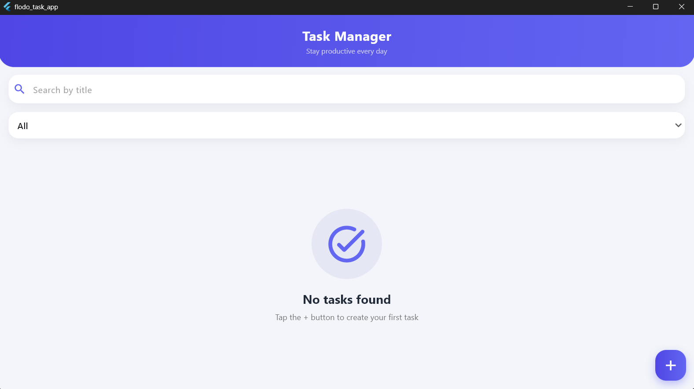
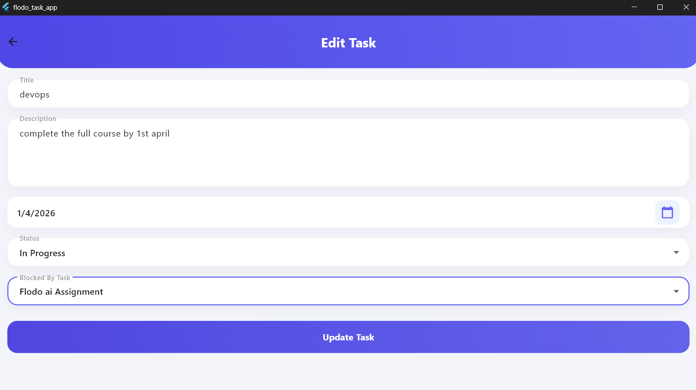
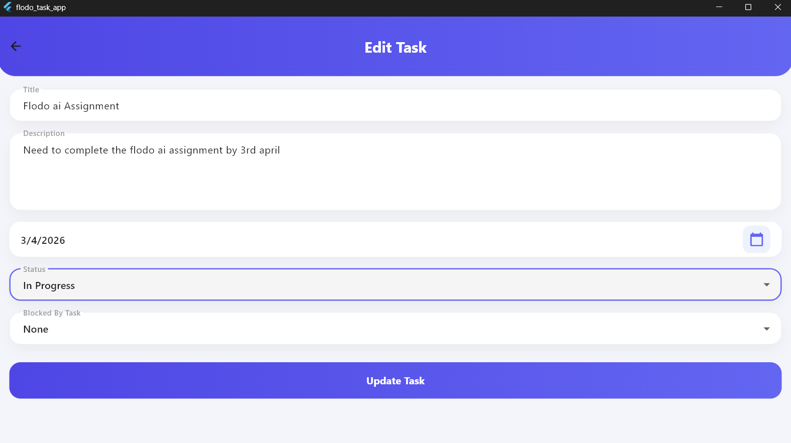
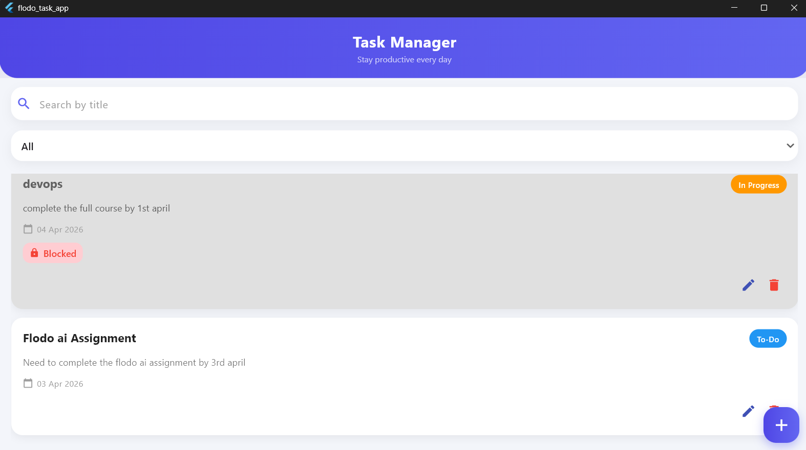
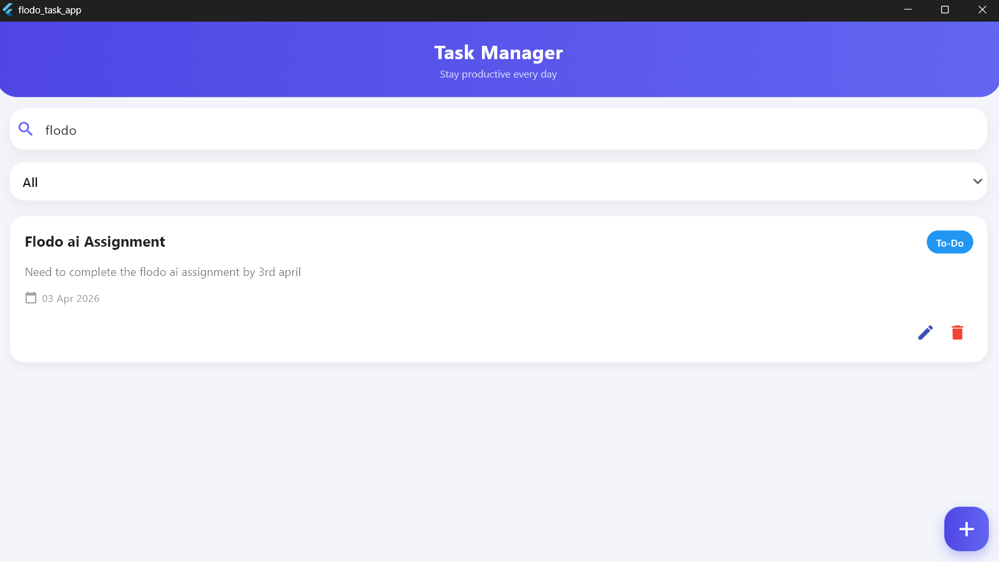

# Flodo Task Manager App

A Flutter-based task management application built for the Flodo AI Take-Home Assignment.

This app allows users to create, update, delete, search, filter, and manage tasks with a clean UI and local persistence.

---

## Track Chosen

Track B – Mobile Specialist

Reason:
I chose Track B to focus more on UI/UX quality, local persistence, state management, and a polished user experience.

---

## Stretch Goal Chosen

Debounced Search

The search field updates results with a 300ms debounce delay to avoid unnecessary filtering on every keystroke.

---

## Features

### Core Features

- Create a new task
- Edit existing tasks
- Delete tasks
- Search tasks by title
- Filter tasks by status
- Persist task data locally across app restarts
- Draft persistence while typing in task creation screen
- Blocked task dependency logic
- Visual indication for blocked tasks
- 2-second simulated loading delay on create/update
- Save button disabled during loading state

### Task Fields

Each task contains:

- Title
- Description
- Due Date
- Status
  - To-Do
  - In Progress
  - Done
- Blocked By (optional dependency on another task)

---

## Blocked Task Logic

If Task B depends on Task A and Task A is not marked as Done:

- Task B appears visually disabled
- Task B gets a greyed-out style
- Task B shows a blocked badge

Once Task A is marked as Done, Task B automatically becomes active.

---

## UI Highlights

- Gradient app bars
- Rounded cards and input fields
- Smooth shadows and spacing
- Modern floating action button
- Animated task cards
- Debounced search experience
- Clean and responsive layout

---

## Tech Stack

- Flutter
- Dart
- Hive
- Provider
- SharedPreferences

---

## Packages Used

```yaml
provider: ^6.1.2
hive: ^2.2.3
hive_flutter: ^1.1.0
shared_preferences: ^2.2.2
intl: ^0.19.0
uuid: ^4.5.1
````

---

## Folder Structure

```text
lib/
│
├── main.dart
├── models/
│   └── task_model.dart
├── providers/
│   └── task_provider.dart
├── screens/
│   ├── home_screen.dart
│   └── add_edit_task_screen.dart
├── services/
│   └── draft_service.dart
├── widgets/
│   └── task_card.dart
└── utils/
```

---

## Setup Instructions

### Prerequisites

Make sure Flutter is installed.

Check installation:

```bash
flutter doctor
```

### Clone Repository

```bash
git clone YOUR_REPOSITORY_LINK
cd flodo_task_app
```

### Install Dependencies

```bash
flutter pub get
```

### Run the App

```bash
flutter run
```

---

## How to Use

### Create Task

* Click the + button
* Fill in title, description, due date, and status
* Optionally select a blocked dependency task
* Click Save Task

### Edit Task

* Tap the edit icon on any task card
* Modify details
* Save changes

### Delete Task

* Tap the delete icon on any task card

### Search Tasks

* Use the search bar on the home screen
* Search works by matching task titles

### Filter Tasks

* Use the dropdown filter to filter by:

  * All
  * To-Do
  * In Progress
  * Done

---

## Draft Persistence

If the user starts typing a task but leaves the screen without saving:

* Title and description remain saved
* Reopening the Add Task screen restores the draft automatically

---

## Screenshots

### Home Screen



### Add Task Screen



### Edit Task Screen



### Blocked Task Example



### Search and Filter



---

##Video demo link:
https://drive.google.com/drive/folders/1uFo0PPBn8kWpxYH2UO4F_SUY2I2_l4gv?usp=sharing

---

## AI Usage Report

AI tools used:

* ChatGPT

Areas where AI helped:

* Flutter project structure
* Provider state management
* Hive local storage setup
* Debounced search logic
* Draft persistence implementation
* UI polishing and gradients
* Task blocking logic

Example of AI mistake:

Initially, the edit screen did not prefill task data correctly because initState was missing.

Fix:

* Added initState
* Loaded existing task values into controllers
* Added conditional update logic for editing mode

---

## Future Improvements

* Dark mode support
* Drag-and-drop task ordering
* Recurring tasks
* Notifications/reminders
* Better search highlighting
* Better animations

---

## Author

Ganesh


